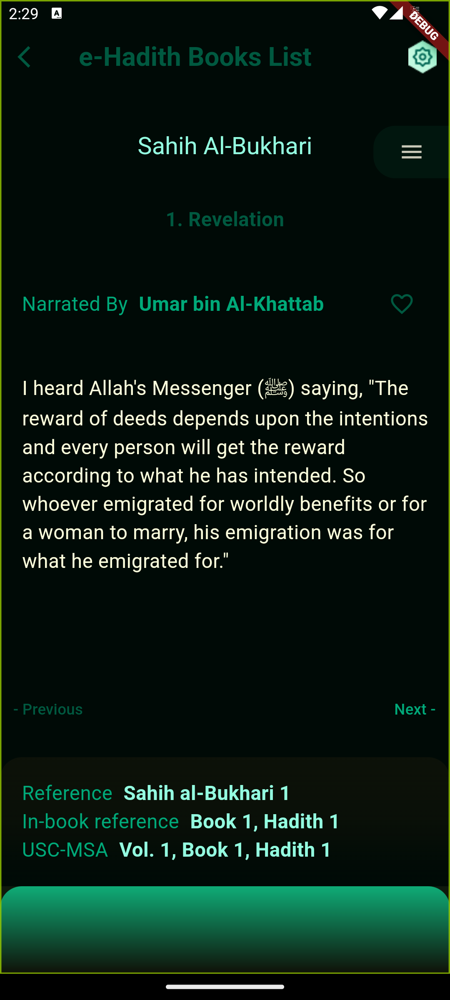
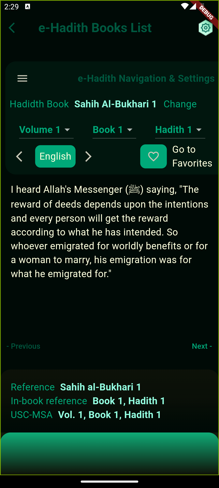
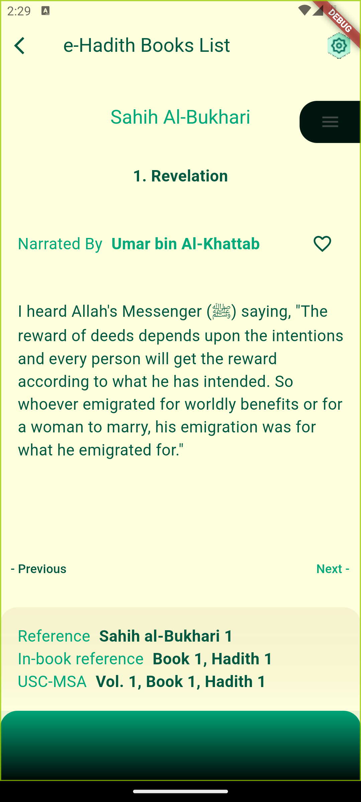
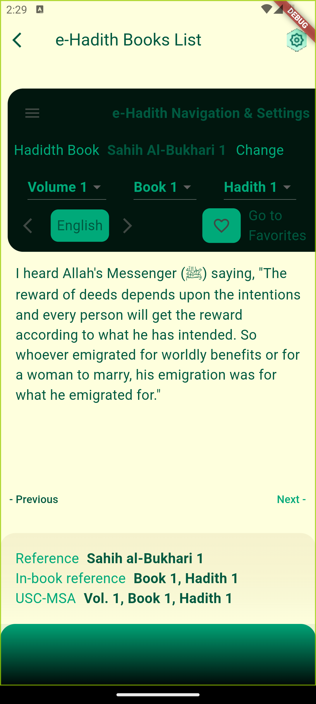

# e_hadid_book_list

A flutter project for interview.

## Screenshots

   

## Challenges during development

- Switching color scheme between light and dark mode was a bit challenging. I had to define color theme for light and dark mode separately and then switch between them using `ThemeData` and `ThemeMode` classes.

- Making Settings overlay was a bit challenging. I had to use `Overlay` and `OverlayEntry` classes to achieve this. but was conflicting with 'OptionMenu' overlay. So I had to use Stack and Positioned widgets.
